# easy-hugo [![melpa badge][melpa-badge]][melpa-link] [![melpa stable badge][melpa-stable-badge]][melpa-stable-link] 

Emacs major mode for writing blogs made with hugo by markdown or org-mode or AsciiDoc or reStructuredText or mmark or html

## Screencast

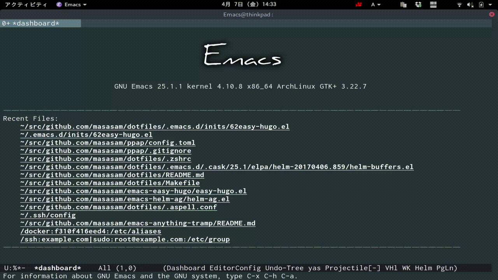

	M-x easy-hugo

You can manage blogs on easy-hugo-mode.
If you manage multiple blogs, you can switch blogs with the < or > key.

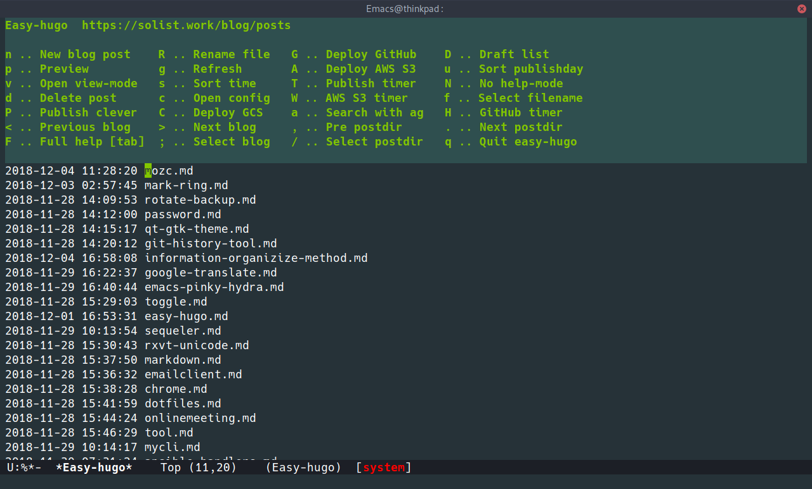

    M-x easy-hugo-newpost

You can post a new article.
Enter a article file name in the minibuffer.
A markdown file is automatically generated.
You can write a blog with markdown.

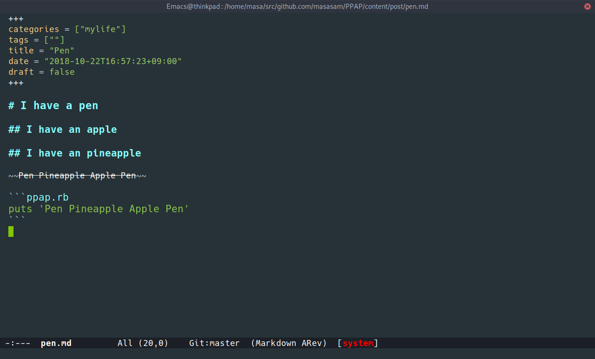

If you enter '.org' file name in the minibuffer, org file is automatically generated and you can write a blog with org-mode.

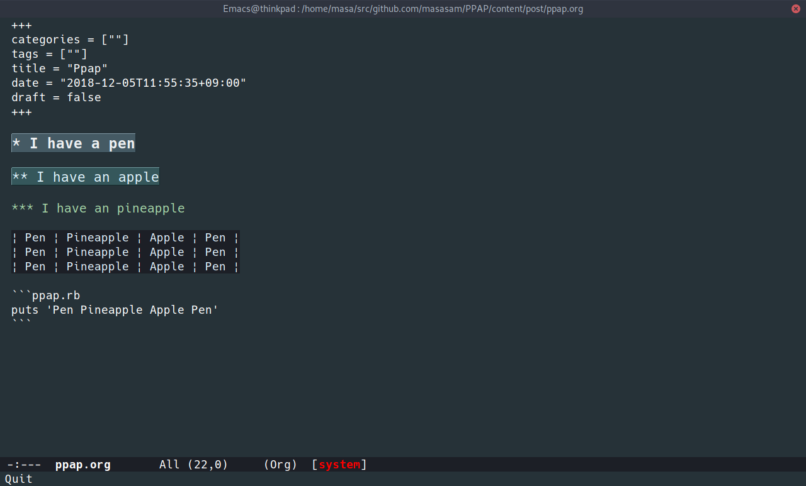

If you enter '.ad' file name in the minibuffer, AsciiDoc file is automatically generated and you can write a blog with AsciiDoc.

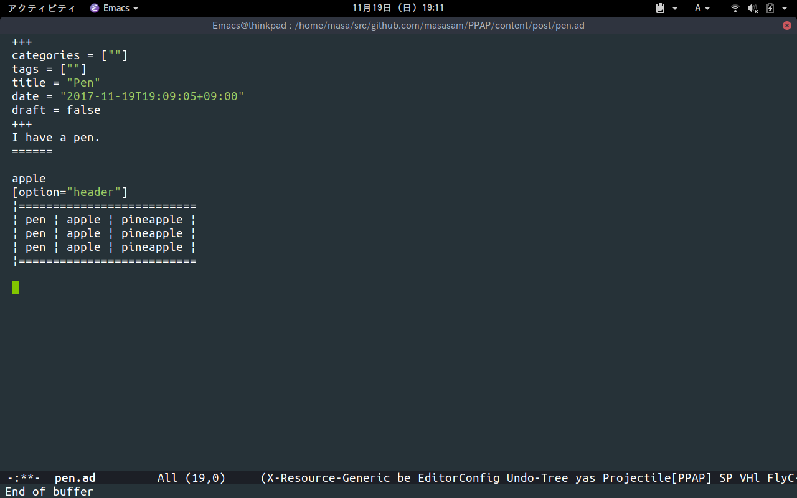

If you enter '.rst' file name in the minibuffer, reStructuredText file is automatically generated and you can write a blog with reStructuredText.

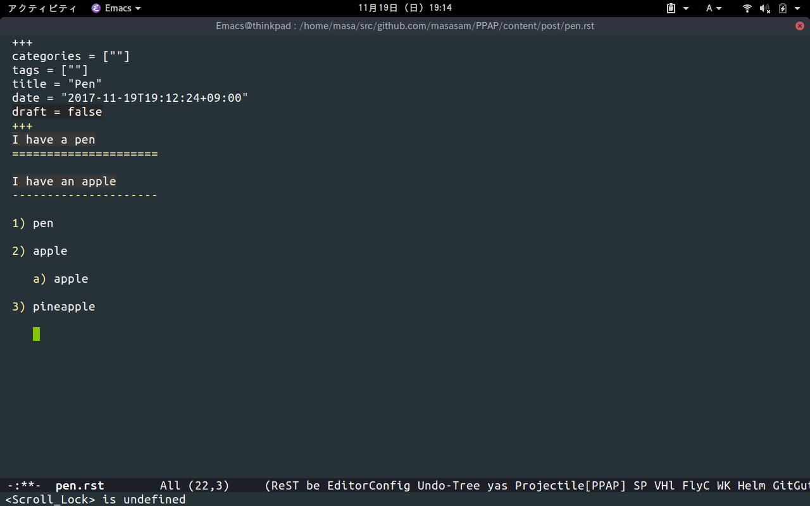

If you enter '.mmark' file name in the minibuffer, mmark file is automatically generated and you can write a blog with mmark.

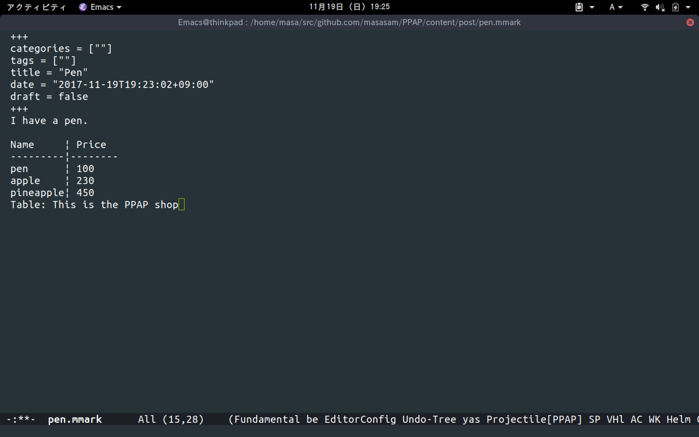

If you enter '.html' file name in the minibuffer, html file is automatically generated and you can write a blog with html.

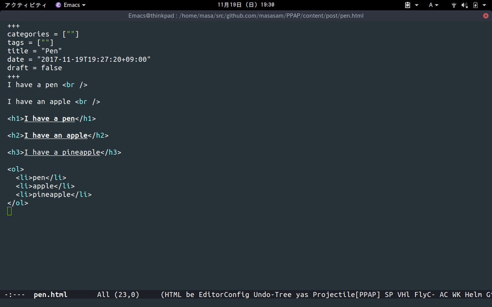

    M-x easy-hugo-preview

If your hugo version is 0.25 or higher, you can preview by following the edited part.
When permalinks is hugo's default and English URL, if you press p with easy-hugo-mode, it displays a preview of the article on pointer.

(The picture of the header is http://www.pixiv.net/member_illust.php?mode=medium&illust_id=60674880)

The browser opens automatically and you can preview the blog on your laptop or desktop.
Even if you run the easy-hugo-preview command many times, only one hugo process will run so do not mind it.
Since the process of hugo running in the laptop or desktop disappears in 300 seconds, you do not have to worry about killing hugo process.

    M-x easy-hugo-publish

You can publish your blog to the server and the browser opens automatically.

	M-x easy-hugo-ag

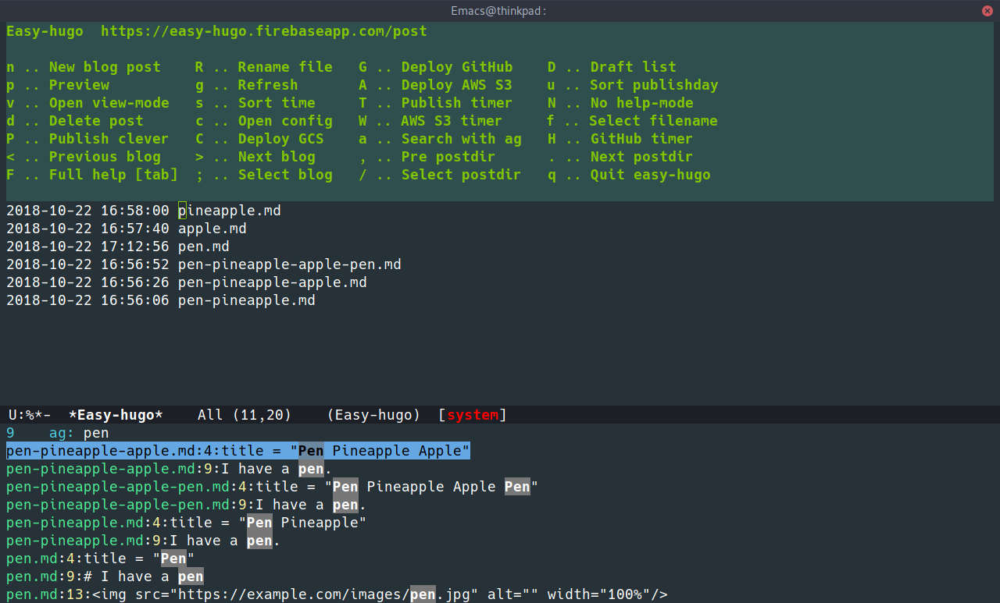

You can search blog article with [counsel-ag](https://github.com/abo-abo/swiper) or [helm-ag](https://github.com/syohex/emacs-helm-ag).
If both are installed, counsel-ag takes precedence at default and
you can use helm-ag by writing the following to .emacs or init.el

	(setq easy-hugo-helm-ag t)

If you deploy your blog at github

	M-x easy-hugo-github-deploy

Execute deploy.sh which exists in directory `easy-hugo-basedir`.
It is useful for hosting on [GitHub Pages](https://gohugo.io/tutorials/github-pages-blog/) etc.
When you create deploy.sh with reference to [hosting](https://gohugo.io/hosting-and-deployment/),
it can also correspond to Firebase etc.
For more information refer to [here](https://github.com/masasam/emacs-easy-hugo/issues/27).

	M-x easy-hugo-amazon-s3-deploy

Deploy hugo source at Amazon S3.

	M-x easy-hugo-google-cloud-storage-deploy

Deploy hugo source at Google Cloud Storage.

	M-x easy-hugo-next-postdir
	M-x easy-hugo-previous-postdir

With this you can go to a directory other than content/post.

	M-x easy-hugo-complete-tags

Auto-complete tags from your past posts.

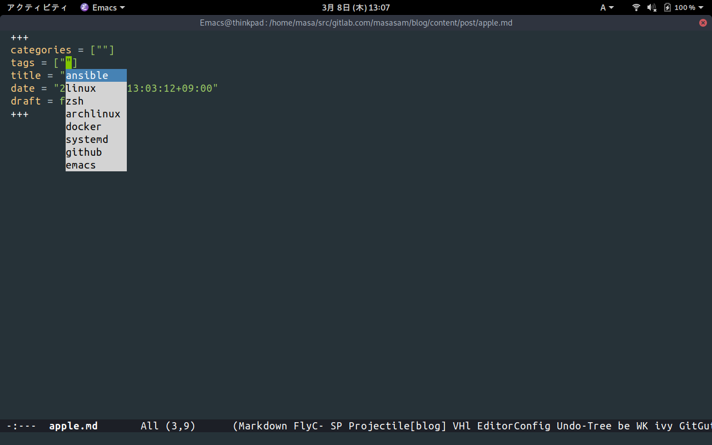

	M-x easy-hugo-complete-categories

Auto-complete categories from your past posts.

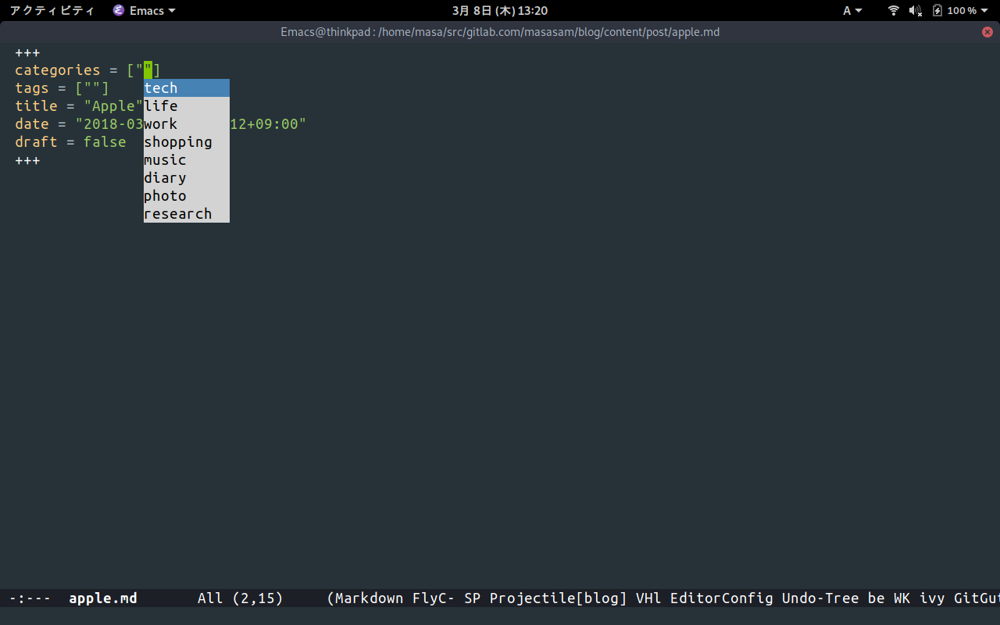

	M-x easy-hugo-current-time

Generate current time in date format at the frontmatter.

	M-x easy-hugo-nth-blog

You can move to a blog with the specified number.

	M-x easy-hugo-image
	M-x easy-hugo-figure

Generate link of image from image file directory under 'static' directory.

When you select the image file you want to use, a link will be inserted.

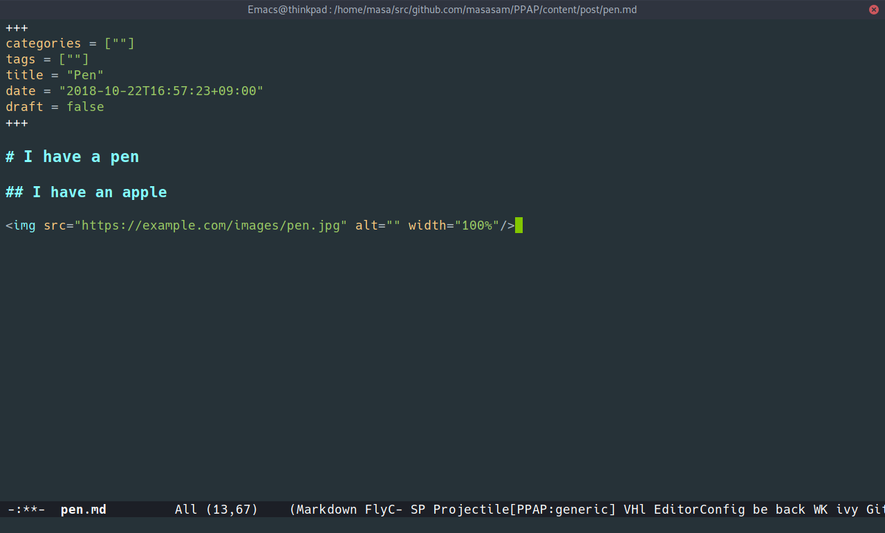

	M-x easy-hugo-put-image
	M-x easy-hugo-put-figure

Move image to 'easy-hugo-image-directory' and generate image link.
You can change the initial launch position with 'easy-hugo-default-picture-directory'.

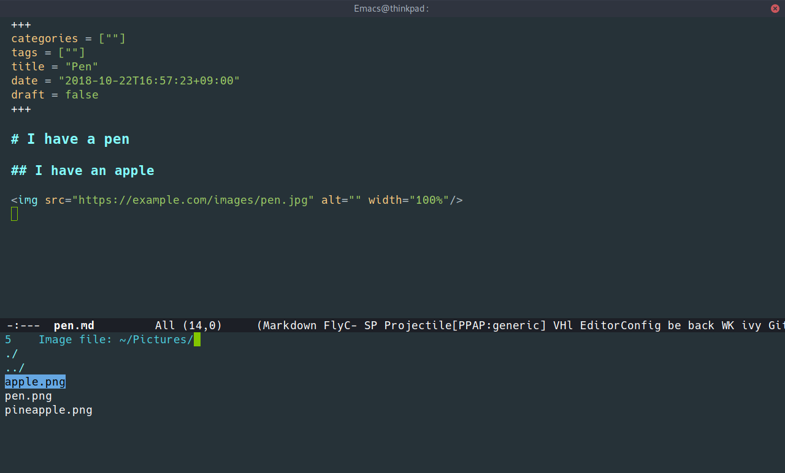

	M-x easy-hugo-pull-image
	M-x easy-hugo-pull-figure

Pull image from internet to image directory and generate image link.
Copy the URL of the image you want to download with your browser.
Execute M-x easy-hugo-pull-image.

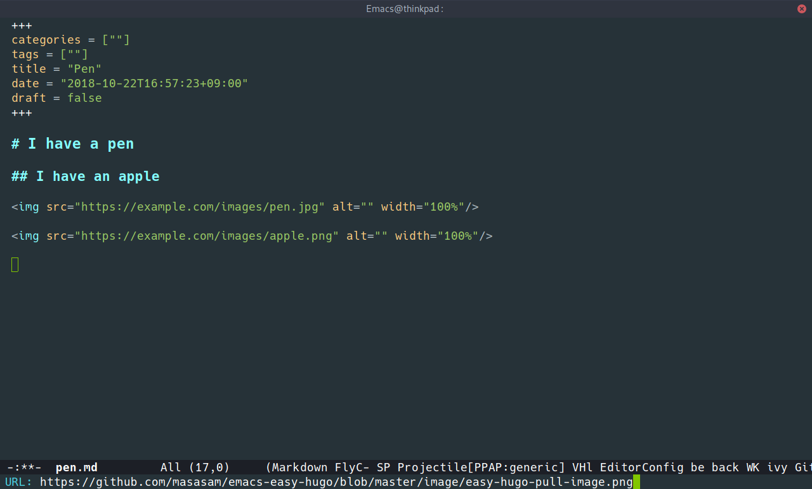

Decide file name.
If you press enter without deciding the file name, the file name can be used as it is.

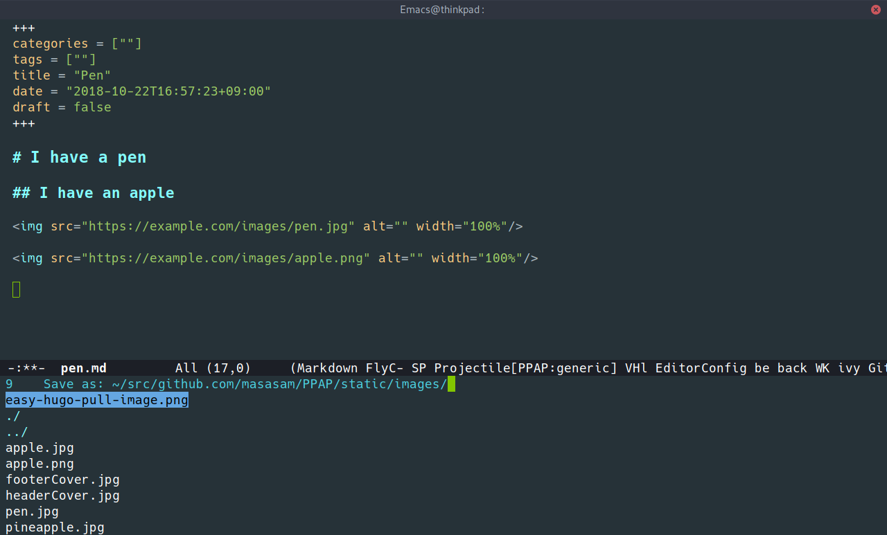

The file is saved in 'easy-hugo-image-directory' and generate image link.

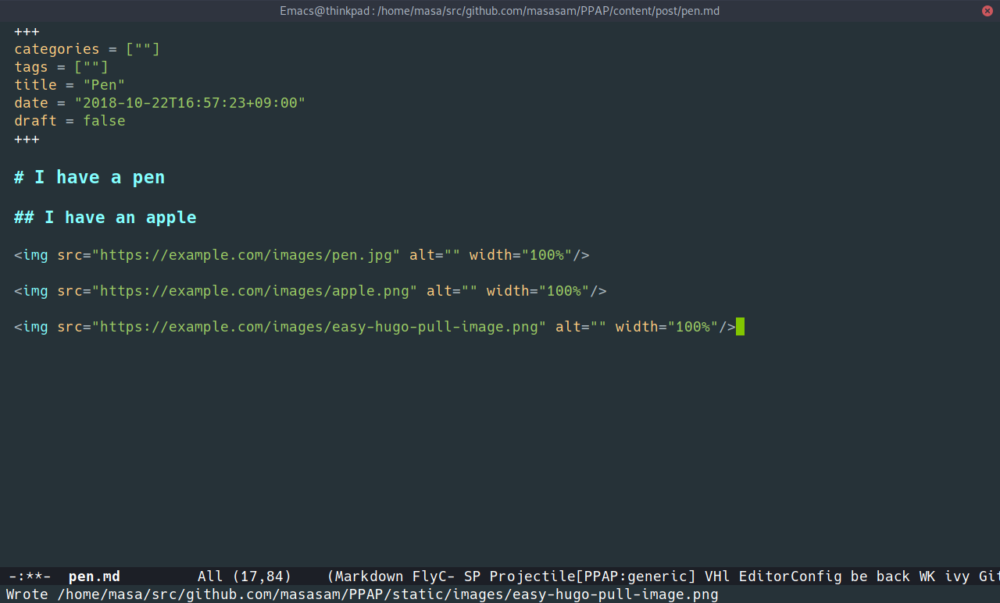

## Commands for easy-hugo-mode

|key    |function      |
|-------|--------------|
|RET	|easy-hugo-open|
|Tab	|easy-hugo-full-help|
|Shift-Tab|easy-hugo-no-help|
|SPC	|easy-hugo-next-line|
|Shift-SPC|easy-hugo-previous-line|
|←	    |easy-hugo-backward-char|
|→     |easy-hugo-forward-char|
|C-b	|easy-hugo-backward-char|
|C-f	|easy-hugo-forward-char|
|C-n	|easy-hugo-next-line|
|C-p	|easy-hugo-previous-line|
|M-b	|easy-hugo-backward-word|
|M-<	|easy-hugo-beginning-of-buffer|
|.      |easy-hugo-next-postdir|
|,      |easy-hugo-previous-postdir|
|+      |easy-hugo-next-postdir|
|-      |easy-hugo-previous-postdir|
|<		|easy-hugo-previous-blog|
|>		|easy-hugo-next-blog|
|?		|describe-mode|
|A		|easy-hugo-amazon-s3-deploy|
|C		|easy-hugo-google-cloud-storage-deploy|
|D		|easy-hugo-list-draft|
|F		|easy-hugo-full-help|
|G		|easy-hugo-github-deploy|
|H		|easy-hugo-github-deploy-timer|
|I		|easy-hugo-google-cloud-storage-deploy-timer|
|J      |easy-hugo-nth-blog|
|M		|easy-hugo-magit|
|N		|easy-hugo-no-help|
|O		|easy-hugo-open-basedir|
|P		|easy-hugo-publish|
|R		|easy-hugo-rename|
|S		|easy-hugo-sort-char|
|T		|easy-hugo-publish-timer|
|V		|easy-hugo-view-other-window|
|W		|easy-hugo-amazon-s3-deploy-timer|
|a		|easy-hugo-ag|
|b		|easy-hugo-cancel-github-deploy-timer|
|c		|easy-hugo-open-config|
|d		|easy-hugo-delete|
|e      |easy-hugo-open|
|f		|easy-hugo-open|
|g		|easy-hugo-refresh|
|h		|easy-hugo-backward-char|
|i		|easy-hugo-cancel-google-cloud-storage-deploy-timer|
|j		|easy-hugo-next-line|
|k		|easy-hugo-previous-line|
|l		|easy-hugo-forward-char|
|m		|easy-hugo-cancel-amazon-s3-deploy-timer|
|n		|easy-hugo-newpost|
|o		|easy-hugo-open-other-window|
|p		|easy-hugo-preview|
|q		|easy-hugo-quit|
|r		|easy-hugo-refresh|
|s		|easy-hugo-sort-time|
|t		|easy-hugo-cancel-publish-timer|
|u		|easy-hugo-sort-publishday|
|v		|easy-hugo-view|
|w		|easy-hugo-newpost|

## Requirements

- Emacs 24.4 or higher
- hugo 0.19 or higher

## Installation

You can install `easy-hugo.el` from [MELPA](http://melpa.org) with package.el
(`M-x package-install easy-hugo`).
Confirm that PATH passes from emacs to go.
I recommend you are going to install [exec-path-from-shell]( https://github.com/purcell/exec-path-from-shell).
Easy-hugo-ag needs [the_silver_searcher](https://github.com/ggreer/the_silver_searcher).
Easy-hugo-ag needs [counsel-ag](https://github.com/abo-abo/swiper) or [helm-ag](https://github.com/syohex/emacs-helm-ag).

## Sample Configuration

	(setq easy-hugo-basedir "~/bookshelf/")
	(setq easy-hugo-url "https://yourblogdomain")
	(setq easy-hugo-sshdomain "blogdomain")
	(setq easy-hugo-root "/home/blog/")
	(setq easy-hugo-previewtime "300")
	(define-key global-map (kbd "C-c C-e") 'easy-hugo)

If you use [use-package](https://github.com/jwiegley/use-package), please write them all in :init.

	(use-package easy-hugo
	:init
	(setq easy-hugo-basedir "~/bookshelf/")
	(setq easy-hugo-url "https://yourblogdomain")
	(setq easy-hugo-sshdomain "blogdomain")
	(setq easy-hugo-root "/home/blog/")
	(setq easy-hugo-previewtime "300")
	:bind ("C-c C-e" . easy-hugo))

|name    |description      |
|-------|--------------|
|easy-hugo-basedir	|Directory where hugo html source code is placed on your laptop or desktop|
|easy-hugo-url	|Url of the blog|
|easy-hugo-sshdomain	|Domain written in ~/.ssh/config|
|easy-hugo-root	|Root directory of hugo at your server|
|easy-hugo-previewtime	|Preview display time|

If you want to change default easy-hugo-postdir.
If not set the default easy-hugo-postdir will be "content/post".
Easy-hugo will not start when easy-hugo-postdir doesn't exist.

	(setq easy-hugo-postdir "content/posts")

If you use [Academic theme](https://themes.gohugo.io/academic/)

	(setq easy-hugo-postdir "content/home")

If you want to deploy hugo at Amazon S3, please install AWS CLI and set easy-hugo-amazon-s3-bucket-name.
Please set up for with `aws configure` command if you are the first time aws command.

	(setq easy-hugo-amazon-s3-bucket-name "your-amazon-s3-bucket-name")

If you want to deploy hugo at Google Cloud Storage, please install Google Cloud SDK and set easy-hugo-google-cloud-storage-bucket-name.
Please set up for with `gcloud auth login` command if you are the first time gcloud command.

	(setq easy-hugo-google-cloud-storage-bucket-name "your-google-cloud-storage-bucket-name")

When writing blog with org-mode at .org file or rst-mode at .rst file or web-mode at .html file,
"C-c C-e" keys are duplicated so please use other keys.

If you want the default extension to be '.org'.
If not set the default extension will be '.md'.

	(setq easy-hugo-default-ext ".org")

If you want the default extension to be '.ad'.
If not set the default extension will be '.md'.

	(setq easy-hugo-default-ext ".ad")

If you want the default extension to be '.rst'.
If not set the default extension will be '.md'.

	(setq easy-hugo-default-ext ".rst")

If you want to change to No help-mode from startup

	(setq easy-hugo-no-help t)

If you want to set charactor-sort at s key.
If not set the default s key will be sort time.

	(setq easy-hugo-sort-default-char t)

If you want to customise color, write the following in the init.el or .emacs.

	(defface easy-hugo-help-face
	'((((class color) (background light)) (:bold t :foreground "your-hex-color" :background "your-hex-color"))
    (((class color) (background dark)) (:bold t :foreground "your-hex-color" :background "your-hex-color")))
	""
	:group 'easy-hugo-faces)

In order to generate link of image from image file directory under 'static' directory,
If you want to change image file directory that is under 'static' directory.
If not set the default image file directory will be 'images'.

	(setq easy-hugo-image-directory "img")

Setting the picture directory of your laptop or desktop, it is easy to execute M-x easy-hugo-put-image

	(setq easy-hugo-default-picture-directory "~/Pictures")

If you want to use org style header

	(setq easy-hugo-org-header t)

Then it becomes the following header

     #+TITLE:  filename
     #+DATE:  2018-01-31T12:10:08-08:00
     #+PUBLISHDATE:  2018-01-31T12:10:08-08:00
     #+DRAFT: nil
     #+TAGS: nil, nil
     #+DESCRIPTION: Short description
	 
## Multiple blogs setting

	;; Main blog
	(setq easy-hugo-basedir "~/bookshelf/")
	(setq easy-hugo-url "https://yourblogdomain")
	(setq easy-hugo-sshdomain "blogdomain")
	(setq easy-hugo-root "/home/blog/")
	(setq easy-hugo-previewtime "300")
	(define-key global-map (kbd "C-c C-e") 'easy-hugo)

	(setq easy-hugo-bloglist
		;; blog2 setting
		'(((easy-hugo-basedir . "~/src/github.com/masasam/hugo2/")
		(easy-hugo-url . "http://example2.com")
		(easy-hugo-sshdomain . "myblogdomain")
		(easy-hugo-root . "/home/hugo/"))
		;; blog3 setting
		((easy-hugo-basedir . "~/src/github.com/masasam/hugo3/")
		(easy-hugo-url . "http://example3.net")
		(easy-hugo-amazon-s3-bucket-name . "yours3bucketname"))
		;; blog4 setting
		((easy-hugo-basedir . "~/src/github.com/masasam/hugo4/")
		(easy-hugo-url . "http://example4.net")
		(easy-hugo-google-cloud-storage-bucket-name . "yourGCPbucketname")
		(easy-hugo-image-directory . "img"))))

If you use [use-package](https://github.com/jwiegley/use-package), please write them all in :init.

	(use-package easy-hugo
	:init
	;; Main blog
	(setq easy-hugo-basedir "~/bookshelf/")
	(setq easy-hugo-url "https://yourblogdomain")
	(setq easy-hugo-sshdomain "blogdomain")
	(setq easy-hugo-root "/home/blog/")
	(setq easy-hugo-previewtime "300")
	(define-key global-map (kbd "C-c C-e") 'easy-hugo)

	(setq easy-hugo-bloglist
		;; blog2 setting
		'(((easy-hugo-basedir . "~/src/github.com/masasam/hugo2/")
		(easy-hugo-url . "http://example2.com")
		(easy-hugo-sshdomain . "myblogdomain")
		(easy-hugo-root . "/home/hugo/"))
		;; blog3 setting
		((easy-hugo-basedir . "~/src/github.com/masasam/hugo3/")
		(easy-hugo-url . "http://example3.net")
		(easy-hugo-amazon-s3-bucket-name . "yours3bucketname"))
		;; blog4 setting
		((easy-hugo-basedir . "~/src/github.com/masasam/hugo4/")
		(easy-hugo-url . "http://example4.net")
		(easy-hugo-google-cloud-storage-bucket-name . "yourGCPbucketname")
		(easy-hugo-image-directory . "img"))))
	:bind ("C-c C-e" . easy-hugo))

You can manage as many blogs as you like.

If you want to change markdown filename extension, please select md or markdown or mdown.
Because only these three are supported by hugo. If not set markdown filename extension will be 'md'.

	(setq easy-hugo-markdown-extension "markdown")

If you want to change asciidoc filename extension, please select ad or asciidoc or adoc.
Because only these three are supported by hugo. If not set asciidoc filename extension will be 'ad'.

	(setq easy-hugo-asciidoc-extension "asciidoc")

If you want to change html filename extension, please select html or htm.
Because only these two are supported by hugo. If not set html filename extension will be 'html'.

	(setq easy-hugo-asciidoc-extension "htm")

## For spacemacs or evil-mode users

If you use [spacemacs](https://github.com/syl20bnr/spacemacs) or [evil-mode](https://github.com/emacs-evil/evil), see [cescoferraro's configration](https://github.com/cescoferraro/dotfiles/blob/master/src/emacs.d/configuration.org#hugo)

## Preparation for using this package

Install hugo
See https://gohugo.io/

Quickstart Guide
See https://gohugo.io/overview/quickstart/

### Configuration file example

config.toml

	hasCJKLanguage = true
	theme="material-design"
	baseurl = "https://example.com"
	languageCode = "ja"
	title = "PPAP blog"
	MetaDataFormat = "toml"
	paginate = 9
	copyright = "© 2017 PPAP blog powered by Hugo"

	[params]
	blogurl = "https://example.com"
	blogdomain = "example.com"
	github = "your github user name"
	twitter = "your twitter user name"
	googleAnalyticsUserID = "UA-************"

archetypes/default.md

	+++
	categories = [""]
	tags = [""]
	title = "{{ replace .TranslationBaseName "-" " " | title }}"
	date = "{{ .Date }}"
    draft = false
	+++

archetypes/default.org (If your hugo version is 0.25 or higher)

	+++
	categories = [""]
	tags = [""]
	title = "{{ replace .TranslationBaseName "-" " " | title }}"
	date = "{{ .Date }}"
    draft = false
	+++

archetypes/default.ad

	+++
	categories = [""]
	tags = [""]
	title = "{{ replace .TranslationBaseName "-" " " | title }}"
	date = "{{ .Date }}"
    draft = false
	+++

archetypes/default.rst

	+++
	categories = [""]
	tags = [""]
	title = "{{ replace .TranslationBaseName "-" " " | title }}"
	date = "{{ .Date }}"
    draft = false
	+++

archetypes/default.mmark

	+++
	categories = [""]
	tags = [""]
	title = "{{ replace .TranslationBaseName "-" " " | title }}"
	date = "{{ .Date }}"
    draft = false
	+++

archetypes/default.html

	+++
	categories = [""]
	tags = [""]
	title = "{{ replace .TranslationBaseName "-" " " | title }}"
	date = "{{ .Date }}"
    draft = false
	+++

### Prepare the server

Let's build with a free trial of "google compute engine" or "amazon ec2".
If you want deploy hugo at GitHub Pages or Amazon S3 or Google Cloud Storage, This paragraph is not necessary.
I created my blog in google compute engine.
Check if rsync is installed on the server.

Write at ~/.ssh/config on your laptop or desktop

	 Host blogdomain
		 HostName "Your server's IP"
         User "Your server's ssh login username"

Because blog is generated under /home/blog/ on the server, set it to reference it with nginx.
SSL uses certbot (Let's encrypt).

sample nginx.conf

	server {
		listen 80;
		server_name yourdomain;
		return  301 https://yourdomain$request_uri;
		location / {
			root /home/blog;
		index	index.html index.htm;
		}
	}
	server {
		listen 443;
		server_name yourdomain;
		ssl on;
		ssl_certificate      /etc/letsencrypt/live/yourdomain/fullchain.pem;
		ssl_certificate_key  /etc/letsencrypt/live/yourdomain/privkey.pem;

	location / {
		root    /home/blog;
	index   index.html index.htm;
		}
	}

PPAP source sample for hugo

https://github.com/masasam/PPAP

[melpa-link]: http://melpa.org/#/easy-hugo
[melpa-badge]: http://melpa.org/packages/easy-hugo-badge.svg
[melpa-stable-link]: http://stable.melpa.org/#/easy-hugo
[melpa-stable-badge]: http://stable.melpa.org/packages/easy-hugo-badge.svg
