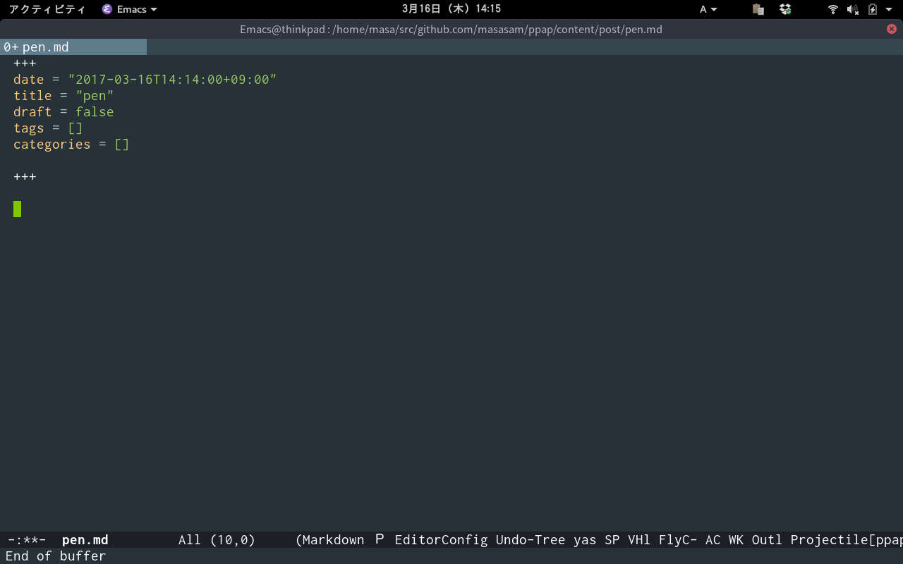

# easy-hugo [![melpa badge][melpa-badge]][melpa-link] [![melpa stable badge][melpa-stable-badge]][melpa-stable-link]

Emacs package for writing blogs made with hugo by markdown or org-mode

## Screenshot

    M-x easy-hugo-newpost

You can post a new article.

Enter a article file name in the minibuffer.

A markdown file is automatically generated.

You can write a blog with markdown.

If you enter '.org' file name in the minibuffer, org file is automatically generated and you can write a blog with org-mode.

    M-x easy-hugo-preview

(The picture of the header is http://www.pixiv.net/member_illust.php?mode=medium&illust_id=60674880)

The browser opens automatically and you can preview the blog on your PC.

Even if you run the easy-hugo-preview command many times, only one hugo process will run so do not mind it.

Since the process of hugo running in the PC disappears in 300 seconds,you do not have to worry about killing hugo process.

    M-x easy-hugo-publish

You can publish your blog to the server and the browser opens automatically.

    M-x easy-hugo-article

Open the list of articles you wrote with dired.

	M-x easy-hugo-deploy

Execute deploy.sh which exists in directory 'easy-hugo-basedir'.

It is useful for hosting on [GitHub Pages](https://gohugo.io/tutorials/github-pages-blog/) etc.

	M-x easy-hugo

You can manage blogs on easy-hugo-mode.

## Requirements

- Emacs 24.4 or higher
- hugo 0.19 or higher

## Installation

You can install `easy-hugo.el` from [MELPA](http://melpa.org) with package.el
(`M-x package-install easy-hugo`).

## Sample Configuration

	(setq easy-hugo-basedir "~/bookshelf/")
	(setq easy-hugo-url "https://yourblogdomain")
	(setq easy-hugo-sshdomain "blogdomain")
	(setq easy-hugo-root "/home/blog/")
	(setq easy-hugo-previewtime "300")
	(define-key global-map (kbd "C-c C-e") 'easy-hugo)

easy-hugo-basedir "Directory where hugo html source code is placed on your PC."

easy-hugo-url "Url of the blog."

easy-hugo-sshdomain "Domain written in ~/.ssh/config."

easy-hugo-root "Root directory of hugo at your server."

easy-hugo-previewtime "Preview display time."

If you want the default extension to be '.org'.

	(setq easy-hugo-default-ext ".org")

If not set the default extension will be '.md'.

## Preparation for useing this package

Install hugo

See https://gohugo.io/

Quickstart Guide

See https://gohugo.io/overview/quickstart/

### Configuration file example

config.toml

	hasCJKLanguage = true
	theme="material-design"
	baseurl = "https://example.com"
	languageCode = "ja"
	title = "PPAP blog"
	MetaDataFormat = "toml"
	paginate = 9
	copyright = "© 2017 PPAP blog powered by Hugo"

	[params]
	blogurl = "https://example.com"
	blogdomain = "example.com"
	github = "your github user name"
	twitter = "your twitter user name"
	googleAnalyticsUserID = "UA-************"

	[permalinks]
	post = "/:year/:month/:day/:title/"

### Prepare the server

Let's build with a free trial of "google compute engine" or "amazon ec2".

I created my blog in google compute engine.

Check if rsync is installed on the server.

Write at ~/.ssh/config on your PC

	 Host blogdomain
                        HostName "Your server's IP"
                        User "Your server's ssh login username"

Because blog is generated under /home/blog/ on the server, set it to reference it with nginx.
Ssl uses certbot.

sample nginx.conf

	server {
		listen 80;
		server_name yourdomain;
		return  301 https://yourdomain$request_uri;
		location / {
			root /home/blog;
		index	index.html index.htm;
		}
	}
	server {
		listen 443;
		server_name yourdomain;
		ssl on;
		ssl_certificate      /etc/letsencrypt/live/yourdomain/fullchain.pem;
		ssl_certificate_key  /etc/letsencrypt/live/yourdomain/privkey.pem;

	location / {
		root    /home/blog;
	index   index.html index.htm;
		}
	}

Confirm that PATH passes from emacs to go.

For example

	(setenv "GOPATH" "~/go")
	(add-to-list 'exec-path (expand-file-name "~/go/bin"))

PPAP source sample

https://github.com/masasam/PPAP

[melpa-link]: http://melpa.org/#/easy-hugo
[melpa-badge]: http://melpa.org/packages/easy-hugo-badge.svg
[melpa-stable-link]: http://stable.melpa.org/#/easy-hugo
[melpa-stable-badge]: http://stable.melpa.org/packages/easy-hugo-badge.svg
